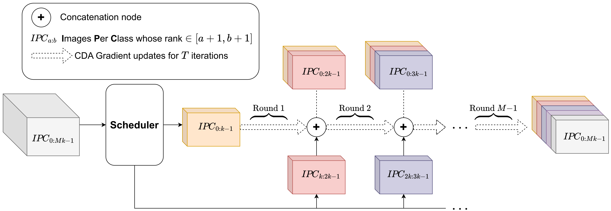
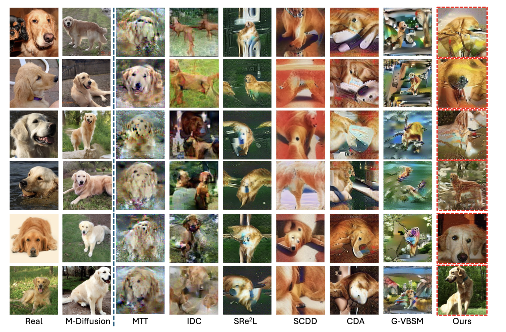
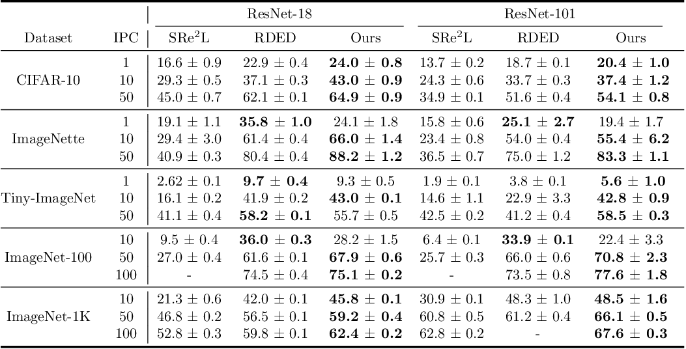
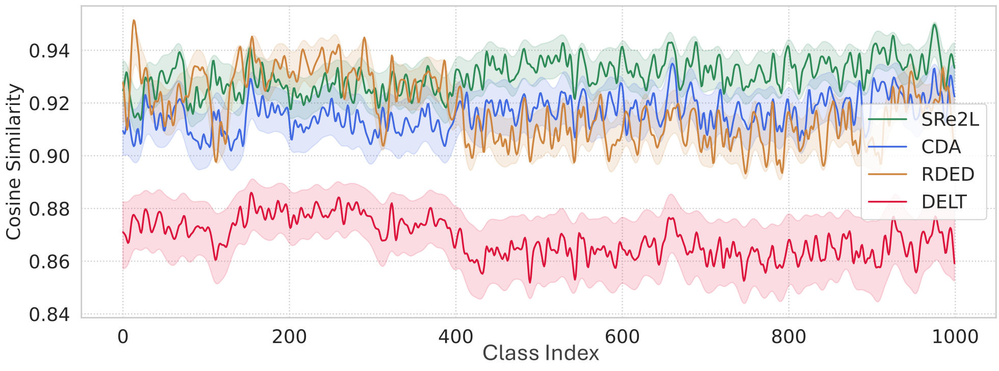

<div align="center">

# DELT: A Simple Diversity-driven EarlyLate Training for Dataset Distillation
<!--
[arXiv] &emsp; [[Distilled Dataset](https://drive.google.com/file/d/1Rr_ik94FNte75yc4GiKtv927qdBwKskr/view?usp=sharing)]
-->

</div>

Official Pytorch implementation to DELT which outperforms SOTA top 1-acc by +1.3% by increasing diversity per class by +5% while reducing time by up to 39.3%.

<div align=center>

</div>

# Contents

- [Abstract](#abstract)
- [📸 Visualization](#-visualization)
- [Usage](#usage)
    - [🗃 Dataset Format](#-dataset-format)
    - [🤖 Squeeze](#-squeeze)
    - [🧲 Ranking and Selection](#-ranking-and-selection)
    - [♻️ Recover](#️-recover)
    - [🧪 Evaluation](#-evaluation)
- [📈 Results](#-results)
# Abstract

Recent advances in dataset distillation have led to solutions in two main directions. The conventional *batch-to-batch* matching mechanism is ideal for small-scale datasets and includes bi-level optimization methods on models and syntheses, such as FRePo, RCIG, and RaT-BPTT, as well as other methods like distribution matching, gradient matching, and weight trajectory matching. Conversely, *batch-to-global* matching typifies decoupled methods, which are particularly advantageous for large-scale datasets. This approach has garnered substantial interest within the community, as seen in SRe$^2$L, G-VBSM, WMDD, and CDA. A primary challenge with the second approach is the lack of diversity among syntheses within each class since samples are optimized independently and the same global supervision signals are reused across different synthetic images. In this study, we propose a new **D**iversity-driven **E**`arly`**L**`ate` **T**raining (DELT) scheme to enhance the diversity of images in batch-to-global matching with less computation. Our approach is conceptually simple yet effective, it partitions predefined IPC samples into smaller subtasks and employs local optimizations to distill each subset into distributions from distinct phases, reducing the uniformity induced by the unified optimization process. These distilled images from the subtasks demonstrate effective generalization when applied to the entire task. We conduct extensive experiments on CIFAR, Tiny-ImageNet, ImageNet-1K, and its sub-datasets. Our approach outperforms the previous state-of-the-art by **1.3%** on average across different datasets and IPCs (images per class), increasing diversity per class by more than **5%** while reducing synthesis time by up to **39.3%**, enhancing the overall efficiency.
# 📸 Visualization

<div align=center>

</div>

# Usage

## 🗃 Dataset Format

The dataset used for recovery and evaluation should be compatbile with [`ImageFolder`](https://pytorch.org/vision/main/generated/torchvision.datasets.ImageFolder.html) class. Refer to the PyTorch documentation for further details.

## 🤖 Squeeze 

For teacher models, we follow both SRe$^2$l, CDA, and RDED, using [official torchvision classification code](https://github.com/pytorch/vision/tree/main/references/classification)—we use torchvision pre-trained model for ImageNet-1K, and the other teacher models could be found in RDED's models [here](https://drive.google.com/drive/folders/1HmrheO6MgX453a5UPJdxPHK4UTv-4aVt?usp=drive_link).

## 🧲 Ranking and Selection

Our DELT uses initialization based on 3 main selection criteria:
1. `top` selects the easiest images, scoring the highest probability of the true class
2. `min` selects the hardest images, scoring the lowest probabilities of the true class
3. `medium` selects the images around the median scores of true class probabilities, used in DELT.

We provide a sample script that in [`scripts`](scripts/) that selects the medium difficulty images from TinyImageNet dataset. You can run the script as below

```bash
bash /path/to/scripts/select_medium_tiny_rn18_ep50_ipc50.sh
```

We overview some variables
- `TRAIN_DIR`: the training directory from which we select the images
- `OUTPUT_DIR`: the output directory where we store the selected images, compatible with [`ImageFolder`](https://pytorch.org/vision/main/generated/torchvision.datasets.ImageFolder.html)
- `RANKER_PATH`: the path to the model used in ranking; if not provided, we use the pre-trained model from torchvision
- `RANKING_FILE`: the path of the output csv file containing the scores of all the images, which is used in selection

## ♻️ Recover

We provide some [`scripts`](scripts/) to automate the experimentation process. For instance to synthesize ImageNet-1K images using ResNet-18 model, you can use 

```bash
bash /path/to/scripts/resnet18_imagenet1k_synthesis.sh
```

You can use the script while changing the variables as appropriate to your experiment. We overview them below

- `SYN_PATH`: the target directory where we synthesize data
- `INIT_PATH`: the path to the initial ImageNet-1K images that will be used in initialization
- `IPC`: the number of **I**mage **P**er **C**lass
- `ITR`: total number of update iterations
- `ROUND_ITR`: the number of update  iterations in a single round

## 🧪 Evaluation

We provide some evaluation [`scripts`](scripts/) to evaluate the synthesized data. For instance to evaluate the synthesized ImageNet-1K images using ResNet-18 model, you can use 

```bash
bash /path/to/scripts/resnet18_imagenet1k_validation.sh
```

# 📈 Results

We compare our approach against different methods on different datasets as below

<div align=center>

</div>

We also visualize the inter-class average cosine similarity as an indication for the diversity (lower values are more diverse)

<div align=center>

</div>